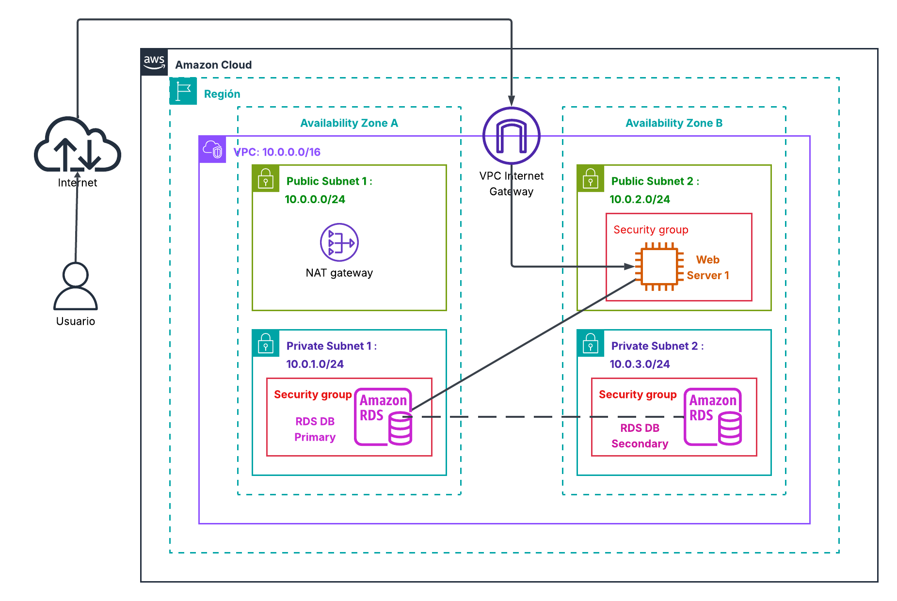

<!-- Banner -->
<p align="center">
  
</p>


<!-- Título centrado -->
<p align="center">
   🌐 Laboratorio – Implementación de una Base de Datos MySQL con Alta Disponibilidad en Amazon RDS
</p>

<!-- Badges centrados -->
<p align="center">
  
  
  
  
  
  
</p>

---

## 🎯 Objetivos del Laboratorio
- 🛠️ Crear una instancia Amazon RDS MySQL
- 🏗️ Configurar subredes, seguridad y conectividad
- 🌐 Permitir conexiones desde un servidor web
- 💾 Interactuar con la base de datos mediante una aplicación
- 📸 Documentar el laboratorio respetando copyright y material protegido

## 🧰 Tecnologías Utilizadas
- ☁️ Amazon RDS (MySQL)
- 🔐 AWS IAM
- 🚀 AWS Console
- 🐬 MySQL Client / Workbench
- 💻 GitHub Codespaces
- ✍️ Markdown
## 🏗️ Infraestructura del Laboratorio

<p align="center">
  
</p>

*Diagrama de la infraestructura: instancia RDS MySQL, subredes, grupos de seguridad y conectividad con la aplicación.*

---

## 📁 Estructura del Repositorio
```text
aws-bbdd-lab01-rds-mysql
┣ 📂 screenshots # 📸 Capturas del proceso
┣ 📂 sql # 🗄️ Scripts SQL utilizados
┣ 📜 README.md # 📘 Documentación principal
┗ 📜 connection-test.txt # 🔍 Resultado de pruebas de conexión
```
## 📸 Buenas Prácticas para Capturas de Pantalla
- ✔ Permitido:
  - Tus configuraciones personales del laboratorio
  - Tus endpoints, nombres y recursos
  - Configuraciones realizadas por ti
- ❌ No permitido:
  - Instrucciones originales de AWS
  - Textos del laboratorio oficial
  - Elementos que contengan copyright directo

## 📝 Desarrollo del Laboratorio
- 🔧 Crear grupo de seguridad
- 🗺️ Crear grupo de subredes
- 📦 Lanzar instancia RDS MySQL Multi-AZ
- 🔗 Obtener endpoint
- 🐬 Conexión desde el cliente MySQL
- 🗄️ Insertar, consultar y mantener datos
- 📸 Añadir evidencias y conclusiones

## 👩‍💻 Autor
Maricruz Quispe Huanto  
Estudiante – Generation Chile - AWS Cloud 7 re/Start  
Repositorio creado con mucha dedicación
